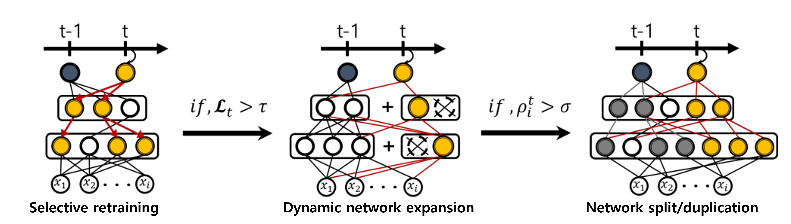

# DEN(Dyanmically Expandable Networks) tensorflow keras

[[LIFELONG LEARNING WITH DYNAMICALLY EXPANDABLE NETWORKS]](https://arxiv.org/abs/1708.01547) 논문을 케라스로 구현하고 테스트 해보았습니다.   

   

---
Selective retraining   
* 새로운 Task에 관련된 뉴런만 학습   

Dynamic network expansion   
* 새로운 Task의 loss가 기준치를 넘지 못하면 뉴런을 증가시키고 증가된 뉴런 중 필요 없는 뉴런은 삭제  

Network split/duplication   
* 기존 가중치가 너무 많이 변한 경우 가중치를 복사하여 붙이기   

## Reference
#### Paper
* https://arxiv.org/abs/1708.01547
#### Code
* https://github.com/jaehong31/DEN
